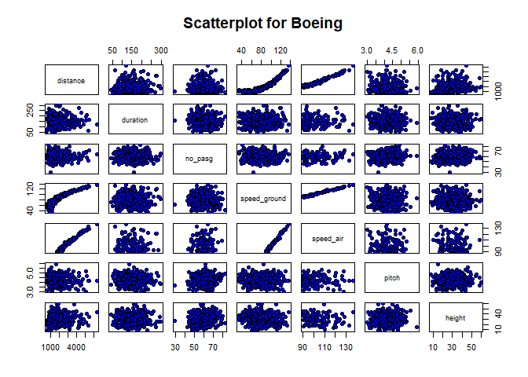

Commercial Flight Landing
================
Submitted by: Anjali Gautam

#### Importing Libraries

``` r
library(broom)
library(readxl)
library(tidyverse)
```

    ## -- Attaching packages -------- tidyverse 1.3.0 --

    ## v ggplot2 3.2.1     v purrr   0.3.3
    ## v tibble  2.1.3     v dplyr   0.8.3
    ## v tidyr   1.0.0     v stringr 1.4.0
    ## v readr   1.3.1     v forcats 0.4.0

    ## -- Conflicts ----------- tidyverse_conflicts() --
    ## x dplyr::filter() masks stats::filter()
    ## x dplyr::lag()    masks stats::lag()

``` r
library(DataExplorer)
library(MASS)
```

    ## 
    ## Attaching package: 'MASS'

    ## The following object is masked from 'package:dplyr':
    ## 
    ##     select

``` r
library(lattice)
library(ggplot2)
```

#### Reading the two Files

``` r
setwd("D:\\Cincinnati\\Classes\\12. Statistical Modelling")
faa1 <- read_excel("FAA1.xls")
faa2 <- read_excel("FAA2.xls")
```

##### Checking the Structure of the files

``` r
str(faa1)
```

    ## Classes 'tbl_df', 'tbl' and 'data.frame':    800 obs. of  8 variables:
    ##  $ aircraft    : chr  "boeing" "boeing" "boeing" "boeing" ...
    ##  $ duration    : num  98.5 125.7 112 196.8 90.1 ...
    ##  $ no_pasg     : num  53 69 61 56 70 55 54 57 61 56 ...
    ##  $ speed_ground: num  107.9 101.7 71.1 85.8 59.9 ...
    ##  $ speed_air   : num  109 103 NA NA NA ...
    ##  $ height      : num  27.4 27.8 18.6 30.7 32.4 ...
    ##  $ pitch       : num  4.04 4.12 4.43 3.88 4.03 ...
    ##  $ distance    : num  3370 2988 1145 1664 1050 ...

``` r
str(faa2)
```

    ## Classes 'tbl_df', 'tbl' and 'data.frame':    150 obs. of  7 variables:
    ##  $ aircraft    : chr  "boeing" "boeing" "boeing" "boeing" ...
    ##  $ no_pasg     : num  53 69 61 56 70 55 54 57 61 56 ...
    ##  $ speed_ground: num  107.9 101.7 71.1 85.8 59.9 ...
    ##  $ speed_air   : num  109 103 NA NA NA ...
    ##  $ height      : num  27.4 27.8 18.6 30.7 32.4 ...
    ##  $ pitch       : num  4.04 4.12 4.43 3.88 4.03 ...
    ##  $ distance    : num  3370 2988 1145 1664 1050 ...

  - There are 800 observations and 8 variables in Faa1 dataset
  - There are 150 observations and 7 variables in Faa2 dataset
  - Duration variable is only present in Faa1 dataset and rest of the
    variables are same in both

#### Merging the two datasets

We will also check for duplicates on common variables between the two
datasets

``` r
flights <- dplyr :: bind_rows(faa1,faa2)

head(flights)
```

    ## # A tibble: 6 x 8
    ##   aircraft duration no_pasg speed_ground speed_air height pitch distance
    ##   <chr>       <dbl>   <dbl>        <dbl>     <dbl>  <dbl> <dbl>    <dbl>
    ## 1 boeing       98.5      53        108.       109.   27.4  4.04    3370.
    ## 2 boeing      126.       69        102.       103.   27.8  4.12    2988.
    ## 3 boeing      112.       61         71.1       NA    18.6  4.43    1145.
    ## 4 boeing      197.       56         85.8       NA    30.7  3.88    1664.
    ## 5 boeing       90.1      70         59.9       NA    32.4  4.03    1050.
    ## 6 boeing      138.       55         75.0       NA    41.2  4.20    1627.

``` r
sum(duplicated(subset(flights,select=-c(duration))))
```

    ## [1] 100

There are 100 duplications in the dataset. Since Duration is missing for
the faa2 data observations because of variable not present in that
table. We will drop duplicates.

``` r
flights <- flights %>% distinct(aircraft,distance,no_pasg,speed_ground,speed_air,height,pitch,.keep_all=TRUE)
```

#### Merged Data

Checking its size and summary of each variable

###### Size of Combined data

``` r
dim(flights)
```

    ## [1] 850   8

Combined data has 850 observations and 8 variables

###### Structure of the combined data

``` r
str(flights)
```

    ## Classes 'tbl_df', 'tbl' and 'data.frame':    850 obs. of  8 variables:
    ##  $ aircraft    : chr  "boeing" "boeing" "boeing" "boeing" ...
    ##  $ duration    : num  98.5 125.7 112 196.8 90.1 ...
    ##  $ no_pasg     : num  53 69 61 56 70 55 54 57 61 56 ...
    ##  $ speed_ground: num  107.9 101.7 71.1 85.8 59.9 ...
    ##  $ speed_air   : num  109 103 NA NA NA ...
    ##  $ height      : num  27.4 27.8 18.6 30.7 32.4 ...
    ##  $ pitch       : num  4.04 4.12 4.43 3.88 4.03 ...
    ##  $ distance    : num  3370 2988 1145 1664 1050 ...

###### Summary of all columns in the combined data

``` r
summary(flights)
```

    ##    aircraft            duration         no_pasg      speed_ground   
    ##  Length:850         Min.   : 14.76   Min.   :29.0   Min.   : 27.74  
    ##  Class :character   1st Qu.:119.49   1st Qu.:55.0   1st Qu.: 65.90  
    ##  Mode  :character   Median :153.95   Median :60.0   Median : 79.64  
    ##                     Mean   :154.01   Mean   :60.1   Mean   : 79.45  
    ##                     3rd Qu.:188.91   3rd Qu.:65.0   3rd Qu.: 92.06  
    ##                     Max.   :305.62   Max.   :87.0   Max.   :141.22  
    ##                     NA's   :50                                      
    ##    speed_air          height           pitch          distance      
    ##  Min.   : 90.00   Min.   :-3.546   Min.   :2.284   Min.   :  34.08  
    ##  1st Qu.: 96.25   1st Qu.:23.314   1st Qu.:3.642   1st Qu.: 883.79  
    ##  Median :101.15   Median :30.093   Median :4.008   Median :1258.09  
    ##  Mean   :103.80   Mean   :30.144   Mean   :4.009   Mean   :1526.02  
    ##  3rd Qu.:109.40   3rd Qu.:36.993   3rd Qu.:4.377   3rd Qu.:1936.95  
    ##  Max.   :141.72   Max.   :59.946   Max.   :5.927   Max.   :6533.05  
    ##  NA's   :642

##### Observations so far from the Dataset

  - Duration variable is not present in both the tables
  - There are 100 duplicates in the combined dataset
  - Speed air has more than 70% NA values in the dataset
  - Duration field has 50 missing values
  - There are 850 rows and 8 rows in the dataset after deleting
    duplicates
  - Out of 8 columns aircraft is a categorical variable and other 7 are
    quantitative variable

#### Detecting and removing abnormal observations

``` r
abnormal_duration <- flights[(flights$duration < 40 & (is.na(flights$duration)==F)),]
abnormal_speed_air <- flights[((flights$speed_air< 30 | flights$speed_air > 140) & (is.na(flights$speed_air)==F)),]

abnormal_speed_ground <- flights[(flights$speed_ground< 30 | flights$speed_ground > 140),]

abnormal_height <- flights[flights$height < 6,]

abnormal_distance <- flights[flights$distance>6000,]
  
v <- filter(flights,(flights$duration > 40 | is.na(flights$duration)==T))
dim(v)
```

    ## [1] 845   8

``` r
v <- filter(v,((v$speed_air >=30 & v$speed_air <= 140)|is.na(v$speed_air)==T))
dim(v)
```

    ## [1] 844   8

``` r
v <- filter(v,(v$speed_ground >=30 & v$speed_ground <= 140))
dim(v)
```

    ## [1] 842   8

``` r
v <- filter(v,v$height >= 6)
dim(v)
```

    ## [1] 832   8

  - There are 5 abnormal values for duration
  - There is 1 abnormal value for speed\_air
  - There are 3 abnormal values for speed\_ground
  - There are 10 abnormal values for height
  - There is 1 abnormal observation common to speed\_air and
    speed\_ground
  - Total 18 abnormal observations are removed from the dataset

#### Structure and summary of the new dataset

``` r
flights_new <- v
str(flights_new)
```

    ## Classes 'tbl_df', 'tbl' and 'data.frame':    832 obs. of  8 variables:
    ##  $ aircraft    : chr  "boeing" "boeing" "boeing" "boeing" ...
    ##  $ duration    : num  98.5 125.7 112 196.8 90.1 ...
    ##  $ no_pasg     : num  53 69 61 56 70 55 54 57 61 56 ...
    ##  $ speed_ground: num  107.9 101.7 71.1 85.8 59.9 ...
    ##  $ speed_air   : num  109 103 NA NA NA ...
    ##  $ height      : num  27.4 27.8 18.6 30.7 32.4 ...
    ##  $ pitch       : num  4.04 4.12 4.43 3.88 4.03 ...
    ##  $ distance    : num  3370 2988 1145 1664 1050 ...

``` r
dim(flights_new)
```

    ## [1] 832   8

``` r
summary(flights_new)
```

    ##    aircraft            duration         no_pasg       speed_ground   
    ##  Length:832         Min.   : 41.95   Min.   :29.00   Min.   : 33.57  
    ##  Class :character   1st Qu.:119.65   1st Qu.:55.00   1st Qu.: 66.20  
    ##  Mode  :character   Median :154.26   Median :60.00   Median : 79.83  
    ##                     Mean   :154.73   Mean   :60.06   Mean   : 79.61  
    ##                     3rd Qu.:189.64   3rd Qu.:65.00   3rd Qu.: 91.99  
    ##                     Max.   :305.62   Max.   :87.00   Max.   :136.66  
    ##                     NA's   :50                                       
    ##    speed_air          height           pitch          distance      
    ##  Min.   : 90.00   Min.   : 6.228   Min.   :2.284   Min.   :  41.72  
    ##  1st Qu.: 96.25   1st Qu.:23.530   1st Qu.:3.640   1st Qu.: 893.43  
    ##  Median :101.15   Median :30.185   Median :4.002   Median :1263.54  
    ##  Mean   :103.65   Mean   :30.474   Mean   :4.005   Mean   :1528.24  
    ##  3rd Qu.:109.40   3rd Qu.:37.018   3rd Qu.:4.370   3rd Qu.:1937.58  
    ##  Max.   :136.42   Max.   :59.946   Max.   :5.927   Max.   :6309.95  
    ##  NA's   :628

Dataset have now 832 observations and 8 variables

#### Plots

###### Histogram for all the numeric variables

``` r
plot_histogram(flights_new)
```

<!-- -->

###### Barplot

``` r
plot_bar(flights_new$aircraft)
```

<!-- -->

  - Cleaned Data has now 832 observations and 8 variables
  - Duration still have 50 NA values and speed\_air has 628 NA values
  - From histograms, distance has a right skewed distribution
  - From histograms, apart from distance and speed\_air variables have
    normal distribution
  - From bar plot, we observe that airbus have more observations than
    boeing

#### Correlation Analysis

Pairwise correlation between Landing distance(distance field) and all
other fields

``` r
corr_func <- function(dat) {
corr_col <- list(cor(y=dat$distance,x=dat[2:7],use="complete.obs"))
corr_df = as.data.frame(corr_col)
colnames(corr_df) = "Correlation"
corr_df['Trend'] = ifelse(corr_df$Correlation > 0 , "Positive", "Negative")
corr_df <- corr_df[order(-abs(corr_df$Correlation)),]
Table <- corr_df
return(Table)
}
Table1 <- corr_func(flights_new)
Table1
```

    ##              Correlation    Trend
    ## speed_air     0.94529684 Positive
    ## speed_ground  0.93171687 Positive
    ## height        0.08568026 Positive
    ## pitch         0.03723416 Positive
    ## duration      0.03671284 Positive
    ## no_pasg      -0.01879416 Negative

#### Scatterplot Matrix

``` r
scatter_func <- function(dat,name){
attach(dat)
return(pairs(~distance+duration+no_pasg+speed_ground+speed_air+pitch+height,main= name,
      pch=21, bg = 'blue'))
detach(dat)
}

scatter_func(flights_new,"Scatterplot for Flights Data")
```

<!-- -->

#### Binary Coding

Coding aircraft in binary variable airbus = 1 and boeing =0

``` r
flights_new['aircraft'] <- ifelse(flights_new$aircraft=="airbus",1,0)
as.data.frame(table(flights_new$aircraft))
```

    ##   Var1 Freq
    ## 1    0  388
    ## 2    1  444

``` r
airbus <- flights_new[flights_new$aircraft==1,]
boeing <- flights_new[flights_new$aircraft==0,]
```

There are 388 boeing and 444 airbus observations in the data
respectively

#### Correlation Analysis for both the datasets

``` r
corr_func(airbus)
```

    ##              Correlation    Trend
    ## speed_air     0.96526576 Positive
    ## speed_ground  0.93993656 Positive
    ## height        0.16388434 Positive
    ## no_pasg      -0.09282119 Negative
    ## pitch         0.07153580 Positive
    ## duration      0.04167093 Positive

``` r
corr_func(boeing)
```

    ##              Correlation    Trend
    ## speed_air     0.97782611 Positive
    ## speed_ground  0.96921332 Positive
    ## pitch        -0.08268187 Negative
    ## height        0.06277574 Positive
    ## duration      0.04917634 Positive
    ## no_pasg       0.03520464 Positive

``` r
scatter_func(airbus,"Scatterplot for Airbus")
```

    ## The following objects are masked from dat (pos = 3):
    ## 
    ##     aircraft, distance, duration, height, no_pasg, pitch,
    ##     speed_air, speed_ground

<!-- -->

``` r
scatter_func(boeing,"Scatterplot for Boeing")
```

    ## The following objects are masked from dat (pos = 3):
    ## 
    ##     aircraft, distance, duration, height, no_pasg, pitch,
    ##     speed_air, speed_ground

    ## The following objects are masked from dat (pos = 4):
    ## 
    ##     aircraft, distance, duration, height, no_pasg, pitch,
    ##     speed_air, speed_ground

<!-- -->

#### Regressing Landing distance on each of the variables in the dataset

``` r
p1 <- tidy(lm(distance~duration,data=flights_new))$p.value[2]
p2 <- tidy(lm(distance~no_pasg,data=flights_new))$p.value[2]
p3 <- tidy(lm(distance~speed_air,data=flights_new))$p.value[2]
p4 <- tidy(lm(distance~speed_ground,data=flights_new))$p.value[2]
p5 <- tidy(lm(distance~pitch,data=flights_new))$p.value[2]
p6 <- tidy(lm(distance~height,data=flights_new))$p.value[2]
p7 <- tidy(lm(distance~aircraft,data=flights_new))$p.value[2]

reg1 <- tidy(lm(distance~duration,data=flights_new))$estimate[2]
reg2 <- tidy(lm(distance~no_pasg,data=flights_new))$estimate[2]
reg3 <- tidy(lm(distance~speed_air,data=flights_new))$estimate[2]
reg4 <- tidy(lm(distance~speed_ground,data=flights_new))$estimate[2]
reg5 <- tidy(lm(distance~pitch,data=flights_new))$estimate[2]
reg6 <- tidy(lm(distance~height,data=flights_new))$estimate[2]
reg7 <- tidy(lm(distance~aircraft,data=flights_new))$estimate[2]

p.values <- c(p1,p2,p3,p4,p5,p6,p7)
vars <- c("duration","no_pasg","speed_air","speed_ground","pitch","height","aircraft")
reg.values <- c(reg1,reg2,reg3,reg4,reg5,reg6,reg7)

Table2 <- as.data.frame(cbind(p.values,reg.values))

rownames(Table2) <- vars

Table2['reg.values'] <- ifelse(Table2$reg.values<0,"Negative","Positive")
Table2 <- Table2[order(Table2$p.values),]
Table2['vars'] <- rownames(Table2)
```

###### Table2 ordered from most significance to least significant variable on the basis of p.value

``` r
Table2
```

    ##                   p.values reg.values         vars
    ## speed_ground 2.833344e-252   Positive speed_ground
    ## speed_air     1.980682e-99   Positive    speed_air
    ## aircraft      1.952008e-12   Negative     aircraft
    ## height        2.087142e-03   Positive       height
    ## pitch         1.153563e-02   Positive        pitch
    ## duration      1.226206e-01   Negative     duration
    ## no_pasg       6.840372e-01   Negative      no_pasg

#### Standardise each predictor variable

``` r
flights_scaled <- as.data.frame(scale(flights_new))
flights_scaled['distance'] <- flights_new['distance']
summary(flights_scaled)
```

    ##     aircraft          duration           no_pasg         
    ##  Min.   :-1.0691   Min.   :-2.33333   Min.   :-4.147952  
    ##  1st Qu.:-1.0691   1st Qu.:-0.72579   1st Qu.:-0.675756  
    ##  Median : 0.9343   Median :-0.00974   Median :-0.008026  
    ##  Mean   : 0.0000   Mean   : 0.00000   Mean   : 0.000000  
    ##  3rd Qu.: 0.9343   3rd Qu.: 0.72228   3rd Qu.: 0.659704  
    ##  Max.   : 0.9343   Max.   : 3.12176   Max.   : 3.597716  
    ##                    NA's   :50                            
    ##   speed_ground        speed_air           height        
    ##  Min.   :-2.44504   Min.   :-1.3668   Min.   :-2.47654  
    ##  1st Qu.:-0.71214   1st Qu.:-0.7414   1st Qu.:-0.70931  
    ##  Median : 0.01148   Median :-0.2504   Median :-0.02959  
    ##  Mean   : 0.00000   Mean   : 0.0000   Mean   : 0.00000  
    ##  3rd Qu.: 0.65726   3rd Qu.: 0.5765   3rd Qu.: 0.66833  
    ##  Max.   : 3.02981   Max.   : 3.2835   Max.   : 3.01016  
    ##                     NA's   :628                         
    ##      pitch              distance      
    ##  Min.   :-3.269873   Min.   :  41.72  
    ##  1st Qu.:-0.693273   1st Qu.: 893.43  
    ##  Median :-0.005779   Median :1263.54  
    ##  Mean   : 0.000000   Mean   :1528.24  
    ##  3rd Qu.: 0.692398   3rd Qu.:1937.58  
    ##  Max.   : 3.650937   Max.   :6309.95  
    ## 

``` r
scaled_model <- lm(distance~.,data=flights_scaled)
summary(scaled_model)
```

    ## 
    ## Call:
    ## lm(formula = distance ~ ., data = flights_scaled)
    ## 
    ## Residuals:
    ##     Min      1Q  Median      3Q     Max 
    ## -291.98  -90.73    9.76   92.69  437.57 
    ## 
    ## Coefficients:
    ##              Estimate Std. Error t value Pr(>|t|)    
    ## (Intercept)  2819.943    158.264  17.818   <2e-16 ***
    ## aircraft     -221.310     10.877 -20.347   <2e-16 ***
    ## duration        4.285     10.115   0.424    0.672    
    ## no_pasg       -13.365     10.595  -1.261    0.209    
    ## speed_ground  -63.602    124.150  -0.512    0.609    
    ## speed_air     860.533     66.880  12.867   <2e-16 ***
    ## height        138.440     10.359  13.364   <2e-16 ***
    ## pitch          -7.053     10.064  -0.701    0.484    
    ## ---
    ## Signif. codes:  0 '***' 0.001 '**' 0.01 '*' 0.05 '.' 0.1 ' ' 1
    ## 
    ## Residual standard error: 138.2 on 188 degrees of freedom
    ##   (636 observations deleted due to missingness)
    ## Multiple R-squared:  0.9754, Adjusted R-squared:  0.9745 
    ## F-statistic:  1066 on 7 and 188 DF,  p-value: < 2.2e-16

###### Table3

``` r
p1s <- tidy(lm(distance~duration,data=flights_scaled))$p.value[2]
p2s <- tidy(lm(distance~no_pasg,data=flights_scaled))$p.value[2]
p3s <- tidy(lm(distance~speed_air,data=flights_scaled))$p.value[2]
p4s <- tidy(lm(distance~speed_ground,data=flights_scaled))$p.value[2]
p5s <- tidy(lm(distance~pitch,data=flights_scaled))$p.value[2]
p6s <- tidy(lm(distance~height,data=flights_scaled))$p.value[2]
p7s <- tidy(lm(distance~aircraft,data=flights_scaled))$p.value[2]

reg1s <- tidy(lm(distance~duration,data=flights_scaled))$estimate[2]
reg2s <- tidy(lm(distance~no_pasg,data=flights_scaled))$estimate[2]
reg3s <- tidy(lm(distance~speed_air,data=flights_scaled))$estimate[2]
reg4s <- tidy(lm(distance~speed_ground,data=flights_scaled))$estimate[2]
reg5s <- tidy(lm(distance~pitch,data=flights_scaled))$estimate[2]
reg6s <- tidy(lm(distance~height,data=flights_scaled))$estimate[2]
reg7s <- tidy(lm(distance~aircraft,data=flights_scaled))$estimate[2]

p.values.s <- list(p1s,p2s,p3s,p4s,p5s,p6s,p7s)
vars.s <- list("duration","no_pasg","speed_air","speed_ground","pitch","height","aircraft")
reg.values.s <- c(reg1s,reg2s,reg3s,reg4s,reg5s,reg6s,reg7s)

Table3 <- as.data.frame(reg.values.s)

rownames(Table3) <- vars

Table3['Direction'] <- ifelse(Table3$reg.values.s<0,"Negative","Positive")
Table3 <- Table3[order(-abs(Table3$reg.values.s)),]
Table3
```

    ##              reg.values.s Direction
    ## speed_air       808.72372  Positive
    ## speed_ground    789.13202  Positive
    ## aircraft       -219.34174  Negative
    ## height           97.07273  Positive
    ## pitch            79.75118  Positive
    ## duration        -50.83188  Negative
    ## no_pasg         -12.87247  Negative

``` r
Table1
```

    ##              Correlation    Trend
    ## speed_air     0.94529684 Positive
    ## speed_ground  0.93171687 Positive
    ## height        0.08568026 Positive
    ## pitch         0.03723416 Positive
    ## duration      0.03671284 Positive
    ## no_pasg      -0.01879416 Negative

``` r
Table2
```

    ##                   p.values reg.values         vars
    ## speed_ground 2.833344e-252   Positive speed_ground
    ## speed_air     1.980682e-99   Positive    speed_air
    ## aircraft      1.952008e-12   Negative     aircraft
    ## height        2.087142e-03   Positive       height
    ## pitch         1.153563e-02   Positive        pitch
    ## duration      1.226206e-01   Negative     duration
    ## no_pasg       6.840372e-01   Negative      no_pasg

``` r
Table3
```

    ##              reg.values.s Direction
    ## speed_air       808.72372  Positive
    ## speed_ground    789.13202  Positive
    ## aircraft       -219.34174  Negative
    ## height           97.07273  Positive
    ## pitch            79.75118  Positive
    ## duration        -50.83188  Negative
    ## no_pasg         -12.87247  Negative

The results are not consistent between table 1,2, and 3 Starting from
Table 1, we see that speed air and speed ground are highly correlated to
the Landing distance and duration and number off passenger have least.

From Table 2, we observe similar trend but here speed\_ground has is
more significant than speed\_air

From Table 3, we still find speed air and speed\_ground of being high
significance followed by aircraft and height

#### Creating Master Table (Table0) based on Tables 1,2, and 3

``` r
Table0 <- c("speed_air","speed_ground","height","aircraft", "pitch","no_pasg","duration")

Table0
```

    ## [1] "speed_air"    "speed_ground" "height"       "aircraft"    
    ## [5] "pitch"        "no_pasg"      "duration"

#### Regression Coefficients for different models

``` r
Model1 <- lm(distance~speed_ground,data=flights_new)

Model2 <- lm(distance~speed_air,data=flights_new)

Model3 <- lm(distance~speed_ground+speed_air,data=flights_new)

summary(Model1)
```

    ## 
    ## Call:
    ## lm(formula = distance ~ speed_ground, data = flights_new)
    ## 
    ## Residuals:
    ##    Min     1Q Median     3Q    Max 
    ## -897.8 -323.4  -74.5  212.5 2390.8 
    ## 
    ## Coefficients:
    ##                Estimate Std. Error t value Pr(>|t|)    
    ## (Intercept)  -1808.3445    68.6579  -26.34   <2e-16 ***
    ## speed_ground    41.9109     0.8393   49.94   <2e-16 ***
    ## ---
    ## Signif. codes:  0 '***' 0.001 '**' 0.01 '*' 0.05 '.' 0.1 ' ' 1
    ## 
    ## Residual standard error: 455.5 on 830 degrees of freedom
    ## Multiple R-squared:  0.7503, Adjusted R-squared:   0.75 
    ## F-statistic:  2494 on 1 and 830 DF,  p-value: < 2.2e-16

``` r
summary(Model2)
```

    ## 
    ## Call:
    ## lm(formula = distance ~ speed_air, data = flights_new)
    ## 
    ## Residuals:
    ##     Min      1Q  Median      3Q     Max 
    ## -786.84 -189.16    2.13  206.30  862.50 
    ## 
    ## Coefficients:
    ##              Estimate Std. Error t value Pr(>|t|)    
    ## (Intercept) -5604.993    206.915  -27.09   <2e-16 ***
    ## speed_air      81.016      1.987   40.77   <2e-16 ***
    ## ---
    ## Signif. codes:  0 '***' 0.001 '**' 0.01 '*' 0.05 '.' 0.1 ' ' 1
    ## 
    ## Residual standard error: 282.6 on 202 degrees of freedom
    ##   (628 observations deleted due to missingness)
    ## Multiple R-squared:  0.8916, Adjusted R-squared:  0.8911 
    ## F-statistic:  1662 on 1 and 202 DF,  p-value: < 2.2e-16

``` r
summary(Model3)
```

    ## 
    ## Call:
    ## lm(formula = distance ~ speed_ground + speed_air, data = flights_new)
    ## 
    ## Residuals:
    ##     Min      1Q  Median      3Q     Max 
    ## -829.36 -197.58    5.06  218.28  864.98 
    ## 
    ## Coefficients:
    ##              Estimate Std. Error t value Pr(>|t|)    
    ## (Intercept)  -5611.84     206.93 -27.120  < 2e-16 ***
    ## speed_ground   -14.03      12.98  -1.081    0.281    
    ## speed_air       95.10      13.18   7.216 1.07e-11 ***
    ## ---
    ## Signif. codes:  0 '***' 0.001 '**' 0.01 '*' 0.05 '.' 0.1 ' ' 1
    ## 
    ## Residual standard error: 282.5 on 201 degrees of freedom
    ##   (628 observations deleted due to missingness)
    ## Multiple R-squared:  0.8923, Adjusted R-squared:  0.8912 
    ## F-statistic: 832.3 on 2 and 201 DF,  p-value: < 2.2e-16

We do observe a change of signs for the coefficient of speed\_ground. We
will check correlation between speed air and speed ground

###### Correlation between speed\_air and speed\_ground

``` r
(corr.SA.SG <- cor(flights_new$speed_air,flights_new$speed_ground,use="complete.obs"))
```

    ## [1] 0.9885771

The two variables are higly correlated. I will keep speed air based on
Table0 Ranking list.

#### Fitting six models as per ranking in Table0

``` r
test <- flights_new[c(8,5,6,1,7,3,2)]
arr = array(data=NA,dim=6)
adjarr = array(data=NA,dim=6)
aicarr = array(data=NA,dim=6)
size = array(data=NA,dim=6)
for (i in 2:7){
  datf <- test[,1:i]
  reg_model <- lm(distance~.,data=datf)
  rsq <- summary(reg_model)$r.squared
  adrsq <- summary(reg_model)$adj.r.squared
  aic <- AIC(reg_model)
  arr[i-1]=rsq
  adjarr[i-1]=adrsq
  aicarr[i-1] = aic
  size[i-1]=i-1
}
```

#### Plotting R.Squared values against number of variables

``` r
plot(size,arr,t="l")
```

<!-- -->

We observe an increasing pattern. R-square value is increasing with
increase in number of variables in the model

#### Using adjusted R-square values

``` r
plot(size,adjarr,t="l")
```

<!-- -->

#### Using AIC values

``` r
plot(size,aicarr,type="l")
```

<!-- -->

I will select below variables for building the predictive model for
Landing distance from the observations so far

    * speed_air
    * height
    * pitch
    * aircraft

#### Forward variable selection using StepAIC

``` r
non_nadata <- filter(flights_new,is.na(flights_new$speed_air)==F & is.na(flights_new$duration)==F)
first_model = lm(distance~1,data=non_nadata)
non_naregmodel <- lm(distance~speed_air+height+aircraft+pitch+no_pasg+duration,data=non_nadata)

stepAIC(first_model,direction="forward",scope=list(lower=first_model,upper=non_naregmodel))
```

    ## Start:  AIC=2652.17
    ## distance ~ 1
    ## 
    ##             Df Sum of Sq       RSS    AIC
    ## + speed_air  1 130500410  15540815 2215.1
    ## + aircraft   1   4813145 141228080 2647.6
    ## <none>                   146041225 2652.2
    ## + height     1   1072104 144969121 2652.7
    ## + pitch      1    202469 145838756 2653.9
    ## + duration   1    196839 145844386 2653.9
    ## + no_pasg    1     51585 145989640 2654.1
    ## 
    ## Step:  AIC=2215.05
    ## distance ~ speed_air
    ## 
    ##            Df Sum of Sq      RSS    AIC
    ## + aircraft  1   8421618  7119197 2064.0
    ## + height    1   2947316 12593499 2175.8
    ## + pitch     1    891909 14648906 2205.5
    ## <none>                  15540815 2215.1
    ## + no_pasg   1    115542 15425273 2215.6
    ## + duration  1      5070 15535745 2217.0
    ## 
    ## Step:  AIC=2064.04
    ## distance ~ speed_air + aircraft
    ## 
    ##            Df Sum of Sq     RSS    AIC
    ## + height    1   3479278 3639920 1934.5
    ## <none>                  7119197 2064.0
    ## + duration  1     45170 7074028 2064.8
    ## + no_pasg   1     34898 7084299 2065.1
    ## + pitch     1     14555 7104642 2065.6
    ## 
    ## Step:  AIC=1934.55
    ## distance ~ speed_air + aircraft + height
    ## 
    ##            Df Sum of Sq     RSS    AIC
    ## <none>                  3639920 1934.5
    ## + no_pasg   1     32041 3607879 1934.8
    ## + pitch     1      7971 3631948 1936.1
    ## + duration  1      7299 3632621 1936.2

    ## 
    ## Call:
    ## lm(formula = distance ~ speed_air + aircraft + height, data = non_nadata)
    ## 
    ## Coefficients:
    ## (Intercept)    speed_air     aircraft       height  
    ##    -6045.52        82.83      -439.02        14.22

  - From step 19, the AIC decreases till 3rd point where the variables
    considered are speed\_air, height and aircraft after which when
    pitch is added it increases.
  - From step 21, using stepAIC gave similar results. Starting from step
    1 where AIC is 2652.17, the model adds in speed\_air which gives
    lower AIC. Since we have chosen forward selection method the model
    stops where adding any new variable will only decrease the AIC
  - From the above analysis, the optimal model we get is Landing
    distance regressed over speed\_air, aircraft, and height
